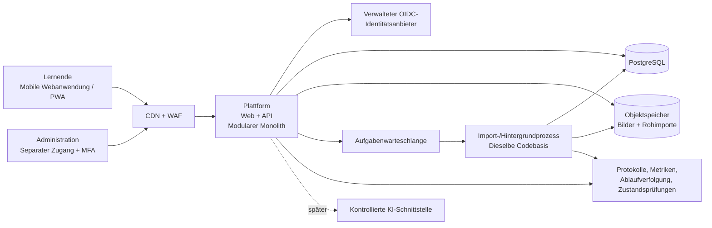
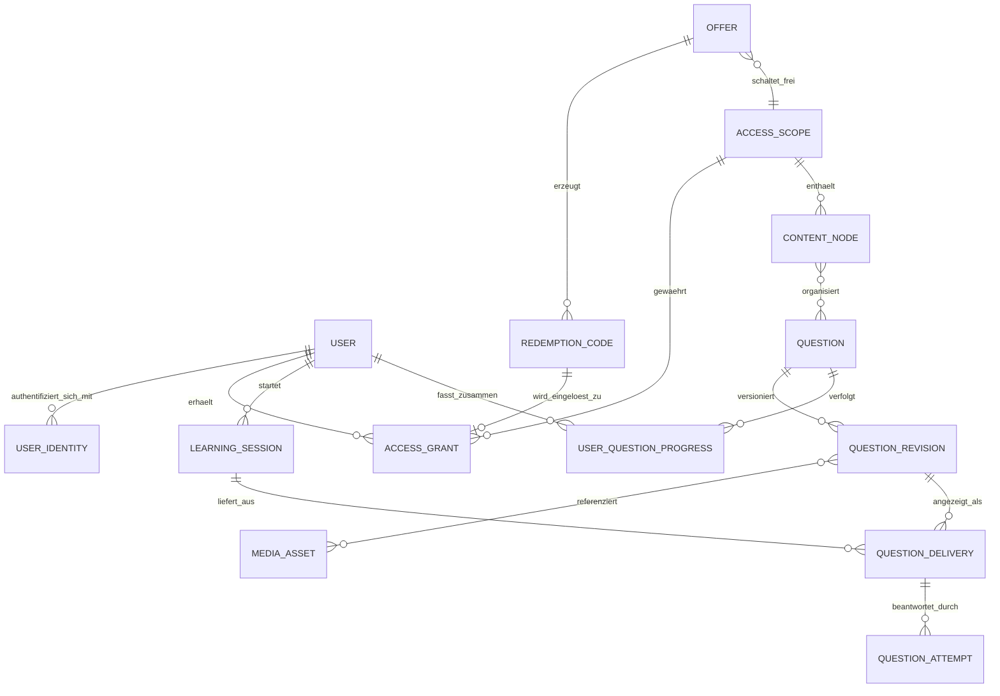
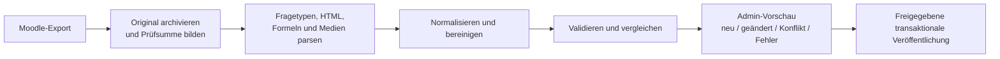

# Zielarchitektur

Status: Entwurf

Zuletzt aktualisiert: 2026-07-16

## Zusammenfassung der Entscheidung

Die mobile Lernplattform und das geschützte Admin-Portal werden als eine modulare Anwendung umgesetzt. Zum Einsatz kommen ein verwalteter Identitätsdienst, PostgreSQL, Objektspeicher und ein separat skalierbarer Hintergrundprozess aus derselben Codebasis. Mikrodienste werden erst eingeführt, wenn gemessene Last oder organisatorische Zuständigkeiten einen konkreten Bedarf dafür schaffen.

## Kontext und Annahmen

- Die bestehende Moodle-Plattform wird vollständig ersetzt.
- Die anfängliche Nutzerzahl liegt bei etwa 2.000–3.000 und steigt perspektivisch auf bis zu 10.000.
- Prüfungszeiträume können kurze, vorhersehbare Lastspitzen mit bis zu 2.000 gleichzeitig aktiven Lernenden verursachen.
- Bestehende Fragen liegen größtenteils maschinenlesbar vor; Formeln und Bilder müssen erhalten bleiben.
- Aus Moodle werden ausschließlich Inhalte migriert; Nutzer, Zugangszeiträume und Lernfortschritte werden nicht übernommen.
- Der Zugang ist zeitlich begrenzt. Bei Online-Käufen beginnt er nach bestätigter Zahlung, bei Printprodukten mit der Codeeinlösung.
- Während der Zugangslaufzeit erhalten Nutzer stets die aktuell veröffentlichten Inhalte und keine feste Prüfungsedition.
- Der Betrieb erfolgt bei AWS in einer EU-Region.
- Die erste Nutzeroberfläche ist eine responsive Webanwendung, keine native mobile App.
- Das Admin-Portal ist Teil des initialen Produktumfangs.

## Systemkontext

## Technologievorschlag

| Bereich | Vorgeschlagene Technologie | Begründung |
|---|---|---|
| Lernenden- und Admin-Oberfläche | Next.js, React, TypeScript | Eine für Mobilgeräte optimierte Codebasis mit server- und browserseitiger Darstellung |
| API | Versionierte HTTP/JSON-Endpunkte innerhalb der Plattformanwendung | Ermöglicht künftig native Apps oder Partneranwendungen, ohne eine zweite Serveranwendung zu benötigen |
| Authentifizierung | Verwalteter OIDC-Anbieter; AWS-Referenz: Cognito | Vermeidet den eigenen Betrieb von Passwörtern und Wiederherstellungsprozessen |
| Daten | Verwaltetes PostgreSQL | Relationale Integrität, Transaktionen, JSONB für variable Fragendaten und native UUID-Unterstützung |
| Medien und Importe | S3-kompatibler Objektspeicher plus CDN | Dauerhafte Speicherung und effiziente Auslieferung von Bildern |
| Hintergrundverarbeitung | Verwaltete Warteschlange plus Hintergrundprozess auf Basis des Plattform-Abbilds | Isoliert Importe und lang laufende Aufgaben, ohne eine separate Dienst-Codebasis zu erfordern |
| Betrieb | AWS-Referenz: CloudFront/WAF, ECS Fargate, RDS, S3, SQS | Verwaltete Skalierung und Betriebskontrollen ohne Kubernetes |
| Beobachtbarkeit | Strukturierte Protokolle, Metriken, Ablaufverfolgung und synthetische Prüfungen | Unterstützt die Störungsanalyse und Überwachung während Prüfungsspitzen |

Die Architektur ist portabel. Falls die umsetzende Organisation bereits einen starken Java-/Spring- oder Azure-Standard hat, bleiben die Komponentengrenzen gültig, auch wenn sich die konkreten Dienste ändern.

## Anwendungsmodule

| Modul | Verantwortlichkeit |
|---|---|
| `identity` | Interne Nutzer und Verknüpfungen zu externen Anmeldeidentitäten |
| `access` | Angebote, Berechtigungsumfänge, Zugangsfreigaben, Printcodes, Käufe und Widerruf |
| `content` | Kurse, Themen, Fragen, Revisionen, Lösungen und Medien |
| `learning` | Sitzungen, ausgelieferte Fragen, Antwortversuche und Fortschritt |
| `admin` | Nutzersupport, Zugangsverwaltung, Veröffentlichung, Rollen und Auditierung |
| `import` | Übernahme von Moodle-Rohdaten, Normalisierung, Validierung, Vorschau und Veröffentlichung |
| `operations` | Systemzustand, Jobstatus, Betriebsmetriken und Supportdiagnosen |
| `ai` | Künftige Funktionsberechtigungen und kontrollierte Integrationsgrenze für KI |

Dies sind Code- und Verantwortungsgrenzen innerhalb einer Bereitstellung. Es handelt sich nicht um initiale Mikrodienste.

## Kerndatenmodell

### Identität und Zugang

- `user`: stabile interne UUID und Kontostatus.
- `user_identity`: eindeutige Kombination aus OIDC-`issuer + subject`; die E-Mail-Adresse ist kein fachlicher Schlüssel.
- `offer`: kommerzielles Produkt oder Printprodukt.
- `access_scope`: freigeschalteter Inhalt oder freigeschaltete Funktion, beispielsweise `exam-2027` oder `feature:ai-tutor`.
- `access_grant`: `valid_from`, `valid_until`, `revoked_at`, Quelle und Nutzer.
- `redemption_code`: einmalig verwendbarer Code, der als kryptografischer Prüfwert mit geheimem Schlüssel gespeichert und in kontrollierten Druckchargen gruppiert wird.

Bei jeder geschützten Anfrage prüft der Server eine aktive Zugangsfreigabe. Codeeinlösung und Verarbeitung von Zahlungs-Webhooks erfolgen atomar und idempotent.

### Inhalte

- `question`: stabile Identität und Verweis auf die aktuell veröffentlichte Revision.
- `question_revision`: unveränderlicher Fragetyp, Darstellungsdaten, ausschließlich serverseitige Lösungsdaten, Metadaten und Inhaltsprüfsumme.
- `media_asset`: validierte Objektspeicherreferenz mit MIME-Typ, Größe und Prüfsumme.
- `content_node`: Kurs, Kapitel, Thema oder eine andere kleine Hierarchieebene.
- `question_source`: stabile Zuordnung von Moodle-Quellkennungen zu Plattformfragen.

Darstellungs- und Bewertungsdaten sind getrennt, damit korrekte Antworten niemals zusammen mit den regulären Lernerdaten zurückgegeben werden. Historische Antwortversuche verweisen stets auf die tatsächlich angezeigte Revision.

### Lernen

- `learning_session`: Lern- oder Prüfungsdurchlauf.
- `question_delivery`: protokolliert, dass eine bestimmte Revision angezeigt wurde und weshalb sie ausgewählt wurde.
- `question_attempt`: unveränderliche Antwort, Ergebnis, Punktzahl und Zeitdaten.
- `user_question_progress`: wiederherstellbare Zusammenfassung für eine schnelle Nutzererfahrung.

Die Erfassung ausgelieferter Fragen zusätzlich zu den Antworten ermöglicht später eine adaptive Auswahl, ohne eine vollständige Ereignisprotokollierung zu erfordern.

## Moodle-Import

Importregeln:

1. Der unveränderte Quellexport bleibt für erneute Verarbeitung und Audits erhalten.
2. Eine stabile Moodle-ID oder explizite Migrations-ID wird als `source_key` bevorzugt; eine Inhaltsprüfsumme darf niemals als Identität dienen.
3. Die TeX-Quelle bleibt erhalten. Vor der Wahl zwischen KaTeX und MathJax wird der tatsächliche Formelbestand validiert.
4. Eingebettete oder referenzierte Bilder werden extrahiert, auf ihren tatsächlichen Dateityp geprüft, mit einer Prüfsumme versehen und als logische Medienreferenzen gespeichert.
5. Sämtliches importiertes HTML wird bereinigt; ausführbare oder nicht unterstützte Inhalte werden abgelehnt.
6. Quell- und kanonische Hashes stellen sicher, dass wiederholte Importläufe idempotent sind.
7. Änderungen erzeugen Entwurfsrevisionen und erfordern vor der Veröffentlichung eine administrative Prüfung.
8. Eine fehlende Frage wird nur dann als Löschung interpretiert, wenn der Import ausdrücklich einen vollständigen Datenstand darstellt.

## Umfang des Admin-Portals

Das Admin-Portal ist Teil der initialen Auslieferung und keine spätere Ergänzung.

- Nutzer gemäß den festgelegten Richtlinien suchen, prüfen, sperren, exportieren und löschen.
- Zugänge prüfen, gewähren, verlängern und widerrufen.
- Printcode-Chargen erstellen und überwachen, ohne gespeicherte Klartextcodes offenzulegen.
- Fragen bearbeiten und unveränderliche Revisionen erstellen.
- Moodle-Importdiagnosen und Vorher-/Nachher-Vorschauen prüfen.
- Inhalte über einen expliziten Ablauf veröffentlichen oder archivieren.
- Abgegrenzte Rollen wie Inhaltsredaktion, Veröffentlichung, Kundenbetreuung und Nutzeradministration verwalten.
- Ein nur erweiterbares Prüfprotokoll für sensible Aktionen einsehen.
- Importjobs, Plattformzustand und supportgeeignete Betriebsdiagnosen einsehen.

Der Admin-Zugang verwendet eine separate OAuth-Anwendung, verpflichtende MFA, serverseitig durchgesetzte Autorisierung und erneute Authentifizierung für kritische Aktionen. Die Oberfläche kann dieselbe Plattformbereitstellung nutzen, bleibt jedoch eine eigenständige Sicherheitsoberfläche.

## Sicherheit und Datenschutz

- Verwaltete Authentifizierung verwenden; Nutzerpasswörter werden nicht in der Plattformdatenbank gespeichert.
- Browsersitzungen in sicheren `HttpOnly`-Cookies halten; Zugriffstokens nicht im Browserspeicher `localStorage` ablegen.
- Moodle-HTML, Formeln, Bilder, SVG und externe URLs als nicht vertrauenswürdige Eingaben behandeln.
- Einlösecodes ausschließlich als kryptografisch starke Digests mit geheimem Schlüssel speichern und Einlöseversuche begrenzen.
- Kostenpflichtige Medien durch privaten Objektspeicher und, sofern erforderlich, zeitlich begrenzte Auslieferungsberechtigungen schützen.
- Daten bei Übertragung und Speicherung verschlüsseln; Geheimnisse in einem verwalteten Geheimnisspeicher ablegen.
- Minimalberechtigungen, Admin-MFA, serverseitige rollenbasierte Zugriffskontrolle und eine nur erweiterbare Auditierung vorschreiben.
- Identifizierende Profildaten logisch von Lerndatensätzen trennen.
- Aufbewahrungs-, Export-, Lösch- und Sicherungsrichtlinien vor dem Produktivbetrieb definieren.
- Keine Passwörter, Tokens, vollständigen Einlösecodes oder unnötigen personenbezogenen Daten protokollieren.

## Skalierung und Betrieb

Die Anzahl registrierter Nutzer allein ist keine geeignete Bemessungsgrundlage; entscheidend sind gleichzeitig aktive Lernende und die Anfragemuster.

Ausgangskonfiguration für den Produktivbetrieb:

- mindestens zwei zustandslose Anwendungsinstanzen über mehrere Ausfallzonen hinweg;
- verwaltetes PostgreSQL mit Hochverfügbarkeit, Sicherungen, zeitpunktbezogener Wiederherstellung und getesteten Wiederherstellungsverfahren;
- Verbindungspooling und übliche relationale Indizes;
- CDN-Auslieferung für statische Dateien und Bilder;
- automatische Skalierung sowie vorab geplante Kapazität für bekannte Prüfungszeiträume;
- Lasttests mit einem vereinbarten Vielfachen des erwarteten gleichzeitigen Datenverkehrs;
- Zustandsendpunkte `/livez` und `/readyz`;
- Alarmierung bei hoher Latenz, Fehlerraten, Datenbanksättigung, Warteschlangentiefe, Login-Fehlern und Importfehlern;
- schrittweise Bereitstellungen und rückwärtskompatible Datenbankmigrationen.

Redis, Kafka, Elasticsearch, Datenbankpartitionierung, Lesereplikate und Kubernetes werden zurückgestellt, bis Messwerte einen konkreten Bedarf belegen.

## Künftige KI und adaptives Lernen

- Kostenpflichtigen KI-Zugang über dasselbe Modell aus `access_scope` und `access_grant` abbilden.
- Adaptives Lernen zunächst mit transparenten Regeln auf Grundlage von Antwortversuchen, Bearbeitungszeit, Aktualität und Themenabdeckung umsetzen.
- Später eine kontrollierte KI-Schnittstelle ergänzen; das Modell erhält niemals direkten Datenbankzugriff.
- Antworten des Lerntutors auf freigegebenen, versionierten Inhalten aufbauen und Inhaltsreferenzen ausgeben.
- Aufbewahrung von KI-Unterhaltungen, Verarbeitung durch Anbieter, Einwilligung und Nutzungslimits getrennt von gewöhnlichen Lerndaten behandeln.

## Offene Entscheidungen

1. Regeln für Verlängerung, Erstattung und Kulanzzeiträume.
2. Zahlungsanbieter und Verhalten beim Gastkauf.
3. Anforderungen an Verfügbarkeit, Wiederherstellungszeit und Wiederherstellungspunkt.
4. Aufbewahrung von Fortschritt und Antwortversuchen nach Ablauf des Zugangs.

## Referenzen

- [Moodle XML-Format](https://docs.moodle.org/501/en/XML)
- [Next.js-Selbsthosting](https://nextjs.org/docs/app/guides/self-hosting)
- [PostgreSQL UUID-Typ](https://www.postgresql.org/docs/current/datatype-uuid.html)
- [OWASP-Prävention von Cross-Site-Scripting](https://cheatsheetseries.owasp.org/cheatsheets/Cross_Site_Scripting_Prevention_Cheat_Sheet.html)
- [Automatische Skalierung von Amazon-ECS-Diensten](https://docs.aws.amazon.com/AmazonECS/latest/developerguide/service-auto-scaling.html)
- [Amazon-RDS-Multi-AZ-Bereitstellungen](https://docs.aws.amazon.com/AmazonRDS/latest/UserGuide/multi-az-db-clusters-concepts.html)
