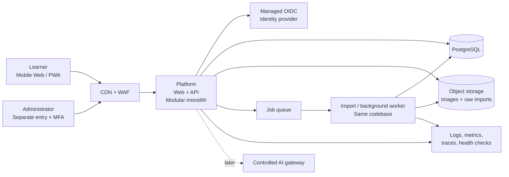
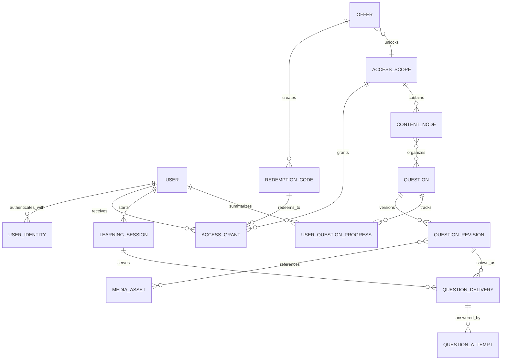
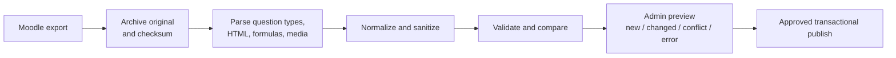

# Target Architecture

Status: Draft

Last updated: 2026-07-16

## Decision summary

Build a mobile-first learning platform and protected admin portal as one modular application. Use managed identity, PostgreSQL, object storage, and a separately scalable background worker from the same codebase. Do not introduce microservices until measured load or organizational ownership creates a concrete need.

## Context and assumptions

- The existing Moodle platform will be fully replaced.
- The initial population is approximately 2,000–3,000 users, growing toward 10,000.
- Examination periods may produce short, predictable traffic peaks.
- Existing questions are largely machine-readable but must retain formulas and images.
- Access is time-limited and originates from print codes, online purchases, or administration.
- The first user experience is a responsive web application, not a native mobile app.
- The admin portal is part of the initial product scope.

## System context

## Technology proposal

| Area | Proposed technology | Reason |
|---|---|---|
| Learner and admin UI | Next.js, React, TypeScript | One mobile-first codebase with server and client rendering |
| API | Versioned HTTP/JSON endpoints in the platform application | Keeps future native or partner clients possible without a second backend |
| Authentication | Managed OIDC provider; AWS reference: Cognito | Avoids operating passwords and recovery flows |
| Data | Managed PostgreSQL | Relational integrity, transactions, JSONB for variable question payloads, native UUID support |
| Media and imports | S3-compatible object storage plus CDN | Durable storage and efficient delivery of images |
| Background work | Managed queue plus worker using the platform image | Isolates imports and long-running tasks without a separate service codebase |
| Hosting | AWS reference: CloudFront/WAF, ECS Fargate, RDS, S3, SQS | Managed scaling and operational controls without Kubernetes |
| Observability | Structured logs, metrics, tracing, synthetic checks | Supports incident diagnosis and examination-peak monitoring |

The architecture is portable. If the delivery organization already has a strong Java/Spring or Azure standard, the component boundaries remain valid even if the concrete services change.

## Application modules

| Module | Responsibility |
|---|---|
| `identity` | Internal users and links to external login identities |
| `access` | Offers, scopes, access grants, print codes, purchases, revocation |
| `content` | Courses, topics, questions, revisions, solutions, and media |
| `learning` | Sessions, delivered questions, attempts, and progress |
| `admin` | User support, access management, publishing, roles, and audit |
| `import` | Raw Moodle intake, normalization, validation, preview, and publishing |
| `operations` | Health, job status, operational metrics, and support diagnostics |
| `ai` | Future feature entitlement and controlled AI integration boundary |

These are code and ownership boundaries inside one deployment. They are not initial microservices.

## Core data model

### Identity and access

- `user`: stable internal UUID and account status.
- `user_identity`: unique OIDC `issuer + subject`; email is not a business key.
- `offer`: commercial or print product.
- `access_scope`: content or feature being unlocked, such as `exam-2027` or `feature:ai-tutor`.
- `access_grant`: `valid_from`, `valid_until`, `revoked_at`, source, and user.
- `redemption_code`: one-time code stored as a keyed digest, grouped into controlled print batches.

Every protected request checks an active grant on the server. Code redemption and payment-webhook processing are atomic and idempotent.

### Content

- `question`: stable identity and pointer to the current published revision.
- `question_revision`: immutable question type, display payload, server-only solution payload, metadata, and content hash.
- `media_asset`: validated object-storage reference with MIME type, size, and checksum.
- `content_node`: course, chapter, topic, or other small hierarchy.
- `question_source`: stable mapping from Moodle source identifiers to platform questions.

Presentation data and grading data are separate so correct answers are never returned with the normal learner payload. Historical attempts always reference the revision that was shown.

### Learning

- `learning_session`: a learning or examination run.
- `question_delivery`: records that a specific revision was shown and why it was selected.
- `question_attempt`: immutable response, result, score, and timing.
- `user_question_progress`: rebuildable summary for fast user experience.

Capturing deliveries as well as answers supports later adaptive selection without requiring event sourcing.

## Moodle import

Import rules:

1. Preserve the untouched source export for replay and audit.
2. Prefer a stable Moodle ID or explicit migration ID as `source_key`; never use a content hash as identity.
3. Preserve TeX source and validate the actual formula corpus before choosing KaTeX or MathJax.
4. Extract embedded or referenced images, validate their real file type, checksum them, and store logical asset references.
5. Sanitize all imported HTML and reject executable or unsupported content.
6. Use source and canonical hashes to make reruns idempotent.
7. Create draft revisions for changes and require admin review before publication.
8. Never interpret a missing question as deletion unless the import is explicitly a complete snapshot.

The first technical spike must test a representative export, all Moodle question types/plugins, complex formulas, images, partial scoring, numerical tolerances, and Cloze or calculated questions.

## Admin scope

The admin portal is part of the initial delivery, not a future add-on.

- Search, inspect, block, export, and delete users according to policy.
- Inspect, grant, extend, and revoke access.
- Create and monitor print-code batches without exposing stored plaintext codes.
- Edit questions and create immutable revisions.
- Review Moodle import diagnostics and before/after previews.
- Publish or archive content through an explicit workflow.
- Manage scoped roles such as content editor, publisher, support, and user administrator.
- Review append-only audit history for sensitive actions.
- View import jobs, platform health, and support-safe operational diagnostics.

Admin entry uses a separate OAuth client, mandatory MFA, server-enforced authorization, and re-authentication for critical actions. The UI may share the platform deployment while remaining a separate security surface.

## Security and privacy

- Use managed authentication; do not store user passwords in the platform database.
- Keep browser sessions in secure, HTTP-only cookies; do not place access tokens in local storage.
- Treat Moodle HTML, formulas, images, SVG, and external URLs as untrusted input.
- Store redemption codes only as high-entropy keyed digests and rate-limit redemption attempts.
- Protect paid media with private object storage and time-limited delivery authorization where required.
- Encrypt data in transit and at rest; keep secrets in a managed secret store.
- Require least privilege, admin MFA, backend RBAC, and append-only auditing.
- Separate identifying profile data logically from learning records.
- Define retention, export, deletion, and backup-expiry policies before production.
- Do not log passwords, tokens, full redemption codes, or unnecessary personal data.

## Scaling and operations

Registered-user count alone is not a sizing measure; concurrent learners and request patterns are.

Initial production posture:

- at least two stateless application tasks across failure zones;
- managed PostgreSQL with high availability, backups, point-in-time recovery, and tested restoration;
- connection pooling and normal relational indexes;
- CDN delivery for static assets and images;
- autoscaling plus scheduled capacity before known examination periods;
- load testing at an agreed multiple of expected concurrent traffic;
- `/livez` and `/readyz` health endpoints;
- alerts on latency, error rates, database saturation, queue depth, login failures, and import failures;
- rolling deployments and backward-compatible database migrations.

Redis, Kafka, Elasticsearch, database partitioning, read replicas, and Kubernetes are deferred until measurements demonstrate a specific need.

## Future AI and adaptive learning

- Represent paid AI access through the same `access_scope` and `access_grant` model.
- Start adaptive learning with transparent rules based on attempts, timing, recency, and topic coverage.
- Add an AI gateway later; the model never receives direct database access.
- Ground tutoring responses in approved, versioned content and return content references.
- Keep AI conversation retention, provider processing, consent, and usage limits separate from ordinary learning data.

## Open decisions

1. Cloud and EU data-residency constraints.
2. Whether users, remaining access periods, and progress are migrated from Moodle.
3. Actual Moodle export format, question types, plugins, and source identifiers.
4. Access start, extension, refund, and grace-period rules.
5. Fixed-edition versus continuously updated product content.
6. Payment provider and guest-checkout behavior.
7. Concurrent-user target and required availability, recovery-time, and recovery-point objectives.
8. Retention of progress and attempts after access expiry.

## References

- [Moodle XML format](https://docs.moodle.org/501/en/XML)
- [Next.js self-hosting](https://nextjs.org/docs/app/guides/self-hosting)
- [PostgreSQL UUID type](https://www.postgresql.org/docs/current/datatype-uuid.html)
- [OWASP Cross Site Scripting Prevention](https://cheatsheetseries.owasp.org/cheatsheets/Cross_Site_Scripting_Prevention_Cheat_Sheet.html)
- [Amazon ECS service auto scaling](https://docs.aws.amazon.com/AmazonECS/latest/developerguide/service-auto-scaling.html)
- [Amazon RDS Multi-AZ deployments](https://docs.aws.amazon.com/AmazonRDS/latest/UserGuide/multi-az-db-clusters-concepts.html)
